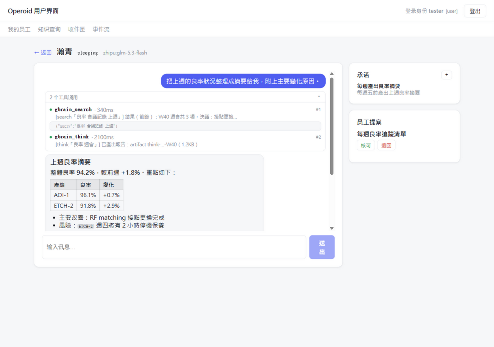
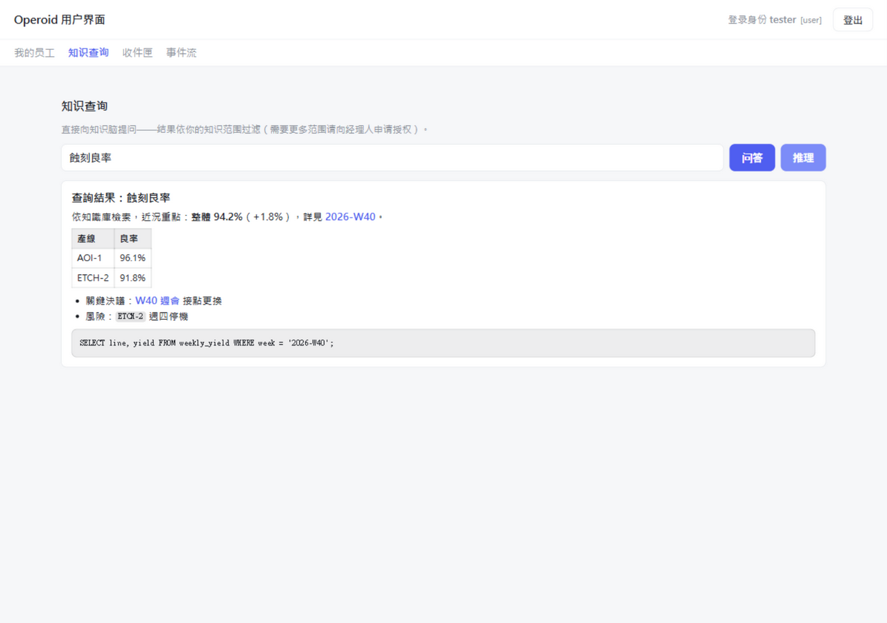
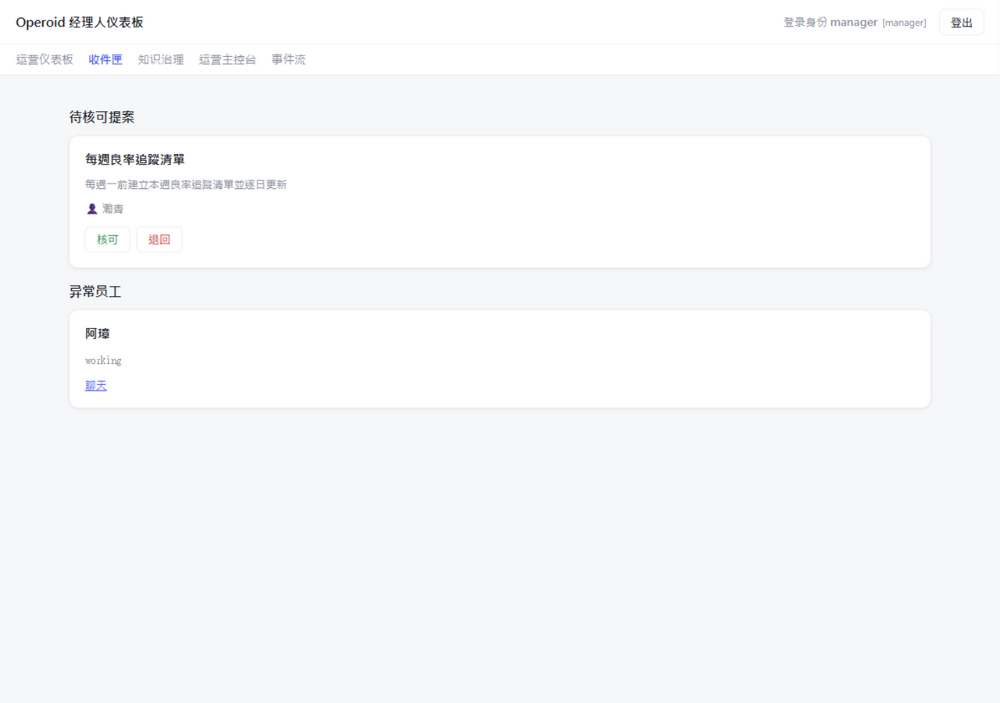

# Operoid

**English** | [繁體中文](README.zh-TW.md) | [简体中文](README.zh-CN.md)

> Operoid is not a chat application. It is an **AI Agent Operating System** — an
> operating environment where AI agents, called **Employees**, continuously do
> meaningful work inside a shared, persistent **Workspace**.

Most AI products are conversation-centric: you ask, it answers, the window
closes and the work is gone. Real work isn't like that. A buyer tracks an order
for weeks; a QA engineer follows a nonconformance from report to corrective
action to closure. Those responsibilities need an environment that
**persists, remembers, and keeps working after the window closes.**

Operoid exists to be that environment.

Built with **Rust** (a resident service + a Tauri v2 desktop shell) and
**Vue 3 + TypeScript** frontends over a local HTTP API.
**Author:** 朱國棟 (Charlie Chu) · **License:** [MIT](#license) · **Status:** see [What Operoid does today](#what-operoid-does-today)

---

## Why Operoid?

Today's AI behaves more like a **consultant** than an **employee**. A consultant
gives advice and leaves. An employee joins the organization, owns outcomes, and
stays accountable. Operoid is built for the latter.

Today's AI systems generally lack:

- **persistent responsibilities** — work vanishes when the chat ends.
- **long-term commitments** — no notion of "track this until it's done."
- **shared workspaces** — nowhere for multiple agents and humans to collaborate on the same things.
- **organizational knowledge** — what the model knows isn't what the organization knows.
- **enterprise roles** — an agent has no identity, authority, or accountability.
- **delegation boundaries** — no principled answer to "what may the machine do without asking."
- **continuous execution** — nothing wakes the agent when something relevant happens.

Operoid treats AI as **organizational members, not chatbots.**

## What you can do today

- **Employees that keep working after you close the window.** A resident
  runtime wakes them on triggers — a schedule, an incoming email, a human
  message — restores their context, lets them work, and puts them back to sleep.
- **From advice to action.** Employees work in their own sandboxed workspace:
  reading files, editing them, running commands — under a per-template tool
  allowlist that *you* control. Nothing is hands-off by default.
- **A work session you can watch.** In the chat, every tool call appears as it
  happens — what the Employee read, what it found, how long it took — and
  replies render as markdown with tables, code, and lists.
- **A boundary you draw — and the machine respects.** Delegation is granted per
  action category, strict by default, expiring, and frozen automatically after
  an incident. See [A delegation boundary humans can draw](#a-delegation-boundary-humans-can-draw).
- **Your company's knowledge, with permissions.** Same brain, same query,
  different identity → different results. Authorization happens before
  retrieval and fails closed. See [A knowledge boundary the server enforces](#a-knowledge-boundary-the-server-enforces).
- **Documents become knowledge — figures included.** Two-column papers,
  scanned reports, figure-heavy decks: parsed into section-aware notes with one
  retrievable item per figure, routed by complexity, degraded visibly, and kept
  local unless a cloud is explicitly opted in.
  See [A document pipeline that reads the whole page](#a-document-pipeline-that-reads-the-whole-page).
- **Reach them where you already are.** Chat in the GUI, email, IM (via WASM
  plugins) — same Employees, same persistent responsibilities.
- **One codebase, two editions.** A desktop installer you just run; an
  enterprise archive your company deploys on its own intranet.





## What is an "AI Agent Operating System"?

A conventional OS manages processes, memory, files, and devices so programs can
run — it provides the environment, it doesn't do the programs' work. Operoid
does the same for AI agents:

| OS concept | In Operoid |
|---|---|
| **Processes** | **Employees** — agents that are scheduled, run, and suspended |
| **Files** | **Artifacts** — durable outputs owned by the workspace, not the chat |
| **Memory** | **Working memory & knowledge** — restored on demand, not held resident |
| **Devices** | **Tools** — external capabilities invoked through a controlled interface |
| **The kernel** | **The Runtime** — wakes an Employee, restores its context, lets it execute, puts it back to sleep |

The Runtime manages **execution**. It never manages **reasoning** — what an
Employee thinks is its own. That is why Operoid is an operating system, not an
application.

## A delegation boundary humans can draw

"Should AI decide?" is not one question but three. **Capability** — can the
system decide correctly? **Accountability** — when the decision is wrong, who
answers for it? **Legitimacy** — is this a decision a human should be making at
all? Only the first answer changes with technology; a delegation policy is sound
only if it passes all three.

Operoid makes this constitutional —
**[Handbook Principle 11, "the boundary is drawn by humans"](handbook/02-Design-Philosophy.md)** —
and then operational:

- **Delegation is granted to action categories**, never to "the system" — each
  tiered as **human adjudication**, **fenced autonomy**, or **owned autonomy**.
- **Strict by default.** Unregistered categories always go to a human; widening
  requires evidence and a signature; tightening is always cheap.
- **The boundary stays alive and auditable.** Authorizations expire and must be
  re-signed; an incident automatically freezes the affected category; the
  machine's classifications are blind-sampled against human reviewers.

None of this was invented from theory. It is distilled from a real
(de-identified) manufacturing case: an autonomous agent that judged for itself
which actions were "routine" and recorded each drift as an achievement. The
full analysis is the essay **[The Shape of the
Boundary](journal/The_Shape_of_the_Boundary_Charlie_Chu.pdf)**; its machinery
ships in the product as the **Action Registry**.

## A knowledge boundary the server enforces

The Action Registry draws the boundary for **actions** — what an Employee may
*do*. The knowledge fabric draws it for **knowledge** — what an Employee may
*know*. Both boundaries share the same constitutional shape: set by humans,
enforced deterministically by the server, auditable after the fact.

- **Authorization happens before retrieval.** Policy is evaluated in pure,
  deterministic code — never by an LLM. Unauthorized knowledge never enters an
  Employee's context; nothing is fetched-then-hidden.
- **One fabric, partitioned into scopes.** Company-common, per-department,
  per-project and restricted knowledge map onto separate sources; a query runs
  against only the **authorized source set** — enforced by the engine itself,
  not by prompt instructions.
- **Fail closed.** A missing or corrupt policy means *deny*, with an event on
  record — and an explicit deny rule outranks everything, including temporary
  grants.
- **Identity is server-side.** Every principal (human or AI Employee)
  authenticates with its own token; identity is resolved from the token chain,
  never from what a caller claims.
- **Everything privileged leaves a receipt.** Who retrieved what, on which
  task, under which policy version. Temporary grants expire by TTL and vanish
  instantly on revocation.
- **Same brain + same query + different identity = different results.** That
  one-liner is proven end-to-end against a real knowledge graph — the smallest
  proof that the fabric actually works.



## A document pipeline that reads the whole page

Most retrieval pipelines read a PDF the way a photocopier reads a painting:
two-column layouts scramble, figures become noise, tables turn to soup. Operoid
treats a complex document as structured knowledge:

- **Parsed like a document, not a text file.** [MinerU](https://github.com/opendatalab/MinerU)
  recovers reading order, tables (real markdown), equations (LaTeX), and every
  figure — with its caption and page number.
- **Chunked the way a human reads.** Notes follow section boundaries; every
  figure becomes its **own retrievable item** (caption + section + page) instead
  of drowning mid-paragraph; tables stay atomic.
- **Routed by complexity, degraded with grace.** Simple PDFs never pay for deep
  parsing — a millisecond fast path handles them. And a missing capability is
  never a silent failure: no MinerU installed → fast path plus an on-screen
  notice; text-only embedding → figures indexed by caption. A **capability
  matrix** (MinerU / multimodal embedding / image reading) is visible in every
  edition — the desktop settings page and the enterprise admin/manager/user
  web UIs — so it is always clear what works now and what unlocks the rest.
- **Benchmarked, not vibes.** On a real IEEE paper, twelve questions about
  specific figures and tables: **12/12 hit in the top 5, MRR 0.90** — through
  the production retrieval stack, not a hand-tuned demo.

Because documents are sensitive, the pipeline follows the same discipline as
everything else: **local by default, explicit tiers for everything else.** Your
own machine is always allowed; a self-hosted endpoint is consented by the act
of configuring it; third-party clouds are **blocked unless you opt in** — and
every conversion records where its data went.

**Multimodal, on your terms.** Embedding runs on your own llama-server. With
the optional mmproj projector, figures are indexed as joint caption+image
vectors in one unified embedding space — a plain-text query finds the right
chart even when its caption says almost nothing. Without it, figures are still
first-class retrievable items by caption, section, and page. The app detects
and surfaces which mode you are in, and upgrading only re-embeds the (small)
figure sidecar.

## Core concepts

| Concept | One-line role |
|---|---|
| **Workspace** | The organization. Everything lives inside exactly one. |
| **Employee** | The worker. An AI agent that owns responsibilities. |
| **Brain** | The intelligence. Reusable, versioned knowledge and persona. |
| **Artifact** | The result. Output of work, owned by the workspace. |
| **Knowledge** | The organization's curated, durable memory. |
| **Tool** | External capability an Employee may invoke. It never decides. |
| **Project** | A bounded collaboration toward a goal. |
| **Task** | A unit of work. Short-lived, executable. |
| **Commitment** | A persistent responsibility that outlives tasks. |
| **Action Registry** | The delegation boundary. Which action categories may act without asking — and which may not. |
| **Knowledge Policy** | The knowledge boundary. Who may retrieve which scope — evaluated before retrieval, fail-closed. |
| **Trigger** | What decides an Employee should wake. |
| **Runtime** | The engine that manages lifecycle, never reasoning. |
| **Event** | The immutable record of what happened. |

The full definitions — purpose, responsibilities, what each owns, lifecycle, and
future extension — live in the **[Architecture Handbook](handbook/README.md)**,
which is the constitution of this operating system.

## What Operoid does today

The Architecture Handbook's roadmap has been **built end-to-end through Phase
7** — the vision is a running system, and the roadmap's five milestones are all
implemented (as of **v0.4.3**):

1. ✅ **One Employee that truly works** — wake on a trigger, restore context, invoke a tool, commit an artifact, sleep.
2. ✅ **Persistence & Commitments** — work survives a full shutdown and restart.
3. ✅ **Shared Brains & Knowledge** — upgrade one Brain, watch many Employees adopt it.
4. ✅ **Templates & Instances** — one template, many independent employees.
5. ✅ **Collaboration** — teams of Employees completing a Project together.

On that foundation, the shipped product includes:

- **Employees with hands, not just advice.** Beyond conversational tools
  (knowledge search & reasoning, notes, messaging), Employees get a sandboxed
  workspace: `read_file` / `write_file` / `edit_file` / `run_command` — enabled
  per template, executed inside their own workspace, and visible in the chat as
  it happens. A todo list persists across turns so long tasks don't drift.
- **A conversation you can watch.** Human–agent chat in the GUI with markdown
  replies, per-tool-call process visibility (arguments, duration, results), a
  "working…" indicator, and expandable artifacts; managers get their own chat
  view of any Employee's conversation. Email and IM reach the same Employees
  through [obridge](obridge/).
- **Artifacts as first-class outputs.** Durable, versioned, owned by the
  workspace (never the chat) — retrievable by ID through the API, expandable
  right in the conversation.
- **A delegation boundary humans can draw** — the **Action Registry** edited
  under **Settings → Registry** (structured forms; raw JSON for advanced use).
- **A knowledge boundary the server enforces** — permission-aware retrieval
  with a **Settings → Knowledge** admin page (principals & tokens, temporary
  grants, scope→source map), plus a user-level knowledge query page.
- **A resident service architecture.** `oserver` owns the Runtime; Employees
  keep working whether or not any window is open. Optional boot-time service on
  Windows (verified) and Linux/macOS (implemented, not yet verified on real
  machines).
- **A knowledge-graph foundation** built on [GBrain](https://github.com/garrytan/gbrain) — turn everyday files (contacts CSVs, meeting PDFs, company write-ups) into linked, queryable notes; sync, ask, and reason over them through a GUI instead of the CLI.
- **A document pipeline that reads the whole page.** MinerU-backed parsing
  (reading order, tables as markdown, equations as LaTeX, every figure with
  caption and page), section-aware chunking, one retrievable item per figure —
  benchmarked on a real IEEE paper at **12/12 top-5, MRR 0.90**. Millisecond
  fast path for simple PDFs; visible degradation for missing tooling; egress
  trust tiers keep documents local unless a cloud is explicitly opted in.
- **Interruptible lifecycle & resilience.** A running Employee can be stopped
  gracefully or archived at any moment (history preserved, unarchivable);
  failed Commitments retry automatically with exponential backoff and hand back
  to a human after repeated failures. Fine-grained process events clean
  themselves up after 30 days; milestone events are kept forever.
- **A first agent entry point:** launch and monitor [Claude Code](https://claude.com/claude-code) from inside the workspace.

## Tech stack

**Frontend:** Vue 3 · TypeScript · Vite · Tailwind CSS v4 · Pinia · Vue Router · vue-i18n · lucide-vue-next
**Enterprise frontends:** `frontends/` pnpm workspace — `@front/api-client` · `@front/ui` · `apps/{admin,manager,user}` (Vue 3.5 · Vite 6 · vue-i18n, served by `oserver`)
**Core & service:** Rust — `ocore` (domain core) · `oserver` (axum service) · `obridge` (mail/WASM bridge)
**Desktop shell:** Tauri v2 (window + desktop-specific capabilities; all logic lives in the service)

## Prerequisites

To use the current knowledge-graph features, the desktop app expects:

| Tool | Why | Install |
|---|---|---|
| **git** | the sync flow commits before updating the graph | <https://git-scm.com/downloads> |
| **bun** | `gbrain` is installed and run through bun | <https://bun.com/docs/installation#installation> |
| **gbrain** | the GBrain knowledge-graph engine | <https://github.com/garrytan/gbrain> |

Paths are auto-detected (e.g. `~/.bun/bin/gbrain.exe` on Windows) and can be
overridden on the **Config** page.

Optional — for the document pipeline (complex PDFs → knowledge):

| Tool | Why | Without it |
|---|---|---|
| **llama-server** (EmbeddingGemma 2) | local embedding backend for retrieval; launch flags in [DEPLOYMENT.md](DEPLOYMENT.md) | retrieval degrades to keyword-only |
| **mmproj projector** (optional) | joint caption+image vectors for figures | figures indexed by caption text |
| **MinerU** (optional) | complex-PDF parsing (two-column / scanned / figures) — `uv tool install mineru` | simple PDFs only, via the fast path |

Everything is detected and surfaced in-app: a capability matrix under
**Settings → Services** (personal edition) and across the enterprise
admin/manager/user web UIs.

## Install & run

**For most users — grab the prebuilt installer.** Download the latest build for
your platform from the
[**Releases** page](https://github.com/ascetic168/Operoid/releases) and run it.
No need to `git clone` or build from source unless you intend to develop Operoid.

### Personal vs. enterprise

| | Personal | Enterprise |
|---|---|---|
| Artifact | Desktop installer | `operoid-enterprise-*` archive |
| Where it runs | The user's own computer | A company intranet server |
| Setup | None — install and run | One guided command (see below) |
| Frontend | The desktop app | Browser: `/admin` `/manager` `/user` |
| Auth | Hidden local token | Password login + role-based access (admin/manager/user) |
| Mail bridge (obridge) | Bundled, managed by the desktop app | Bundled; managed by oserver — form config in `/admin` (or deploy on a separate machine) |

The desktop installer **is** the personal edition.

For the enterprise edition, download the `operoid-enterprise-*` archive from
the same release and run **`oserver configure`** — a guided wizard that checks
prerequisites, sets up TLS and the knowledge-brain workspace, creates the
admin account, and optionally registers the boot-time service. Alternatively,
drop an `operoid.toml` next to the binary by hand — both paths are covered in
**[DEPLOYMENT.md](DEPLOYMENT.md)** (the server machine needs no Node/pnpm).
Two cautions: do **not** run the desktop GUI on the enterprise server (it
speaks personal-mode credentials), and the two editions coexist safely on one
intranet (the personal edition binds to loopback only).

### Installing the boot-time service (Linux / macOS)

On Linux and macOS the boot-time service starts **before any user logs in**
(systemd system unit in `/etc/systemd/system`, or a launchd LaunchDaemon in
`/Library/LaunchDaemons`). Notes for installing it:

- Install it **from your own user account via `sudo`** (e.g. `sudo oserver
  install`). The privileged step only writes the unit file; the service itself
  runs as **the user who installed it**, so the database and settings keep the
  same owner as the desktop app.
- If the installer cannot determine the invoking user (e.g. run from a pure
  root shell), it refuses with an error — install via `sudo` from your account
  instead.
- Remove it with `sudo oserver uninstall`.
- Linux/macOS service paths are implemented but **not yet verified on real
  machines** (Windows is).

### For developers (build from source)

Building the desktop app needs the **Rust toolchain** and the
[Tauri v2 prerequisites](https://v2.tauri.app/start/prerequisites/).

```bash
git clone https://github.com/ascetic168/Operoid.git
cd Operoid
npm install          # install dependencies
npm run tauri dev    # run the app (hot reload)
npm run tauri build  # build a distributable installer
```

Frontend only (in a browser at http://localhost:1420): `npm run dev`,
`npm run build`.

When working on `oserver`/`obridge` directly, build them **together** with
`cargo dev-build` (or `scripts/dev-rebuild.ps1`, which also stops dev
processes first): oserver spawns `obridge` as a sibling executable, so
building only one crate leaves the other stale. Both binaries embed a build
id (git hash) and cross-check at spawn — a mismatch is logged loudly and
shown in the admin UI (`/api/obridge/status` → `exe_build_match`).

## Development

```bash
npm run tauri dev             # full app, hot reload
npm run build                 # frontend typecheck + build
cargo test                    # Rust unit tests (whole workspace: ocore, oserver, …)
cargo check                   # fast backend typecheck (whole workspace)
```

## Project structure

```
src/              Vue 3 frontend (views, Pinia stores, i18n, HTTP wrappers)
                  — Brains, Factories, Config, Employee templates/instances,
                    Employee chat, Operations (live console), Inbox
frontends/        Enterprise web frontends (pnpm workspace)
                  — apps/{admin,manager,user} · packages/{api-client,ui}
ocore/            Rust domain core (zero Tauri deps)
                    domain · runtime · scheduler · event_bus · agents state
                    knowledge (policy/service/planner/grants/receipts/identity)
                    gbrain capabilities (cli/brains/factories/converters) · llm
                    employee tools (workspace sandbox: read/write/edit/command)
oserver/          The resident service — axum HTTP API (token auth)
                    agent-os read/write · GBrain domain · operations console
                    knowledge admin (principals/tokens/grants)
                    event ingress /event · service install (Win/Linux/macOS)
src-tauri/        Desktop shell (Tauri v2) — window, desktop-only features
                    (Claude Code, note preview), command thin-layer, service
                    supervision (start-with-app / stop-with-app)
obridge/          Email bridge + WASM plugin host (IMAP in / SMTP out)
ocontract/        Shared contract types (Operoid ↔ obridge)
handbook/         The Architecture Handbook — the constitution (EN + 中文)
```

## Roadmap

The roadmap is laid out in the handbook, ordered by dependence. All five
milestones have been **implemented through Phase 7** (see
[What Operoid does today](#what-operoid-does-today) for the shipped state).

Phase 7 added the **human-collaboration layer**: commitments handed off to a
human, the Message concept, conversational chat, and error resilience. See
[Chapter 21 — Roadmap](handbook/21-Roadmap.md) for the full picture and what
comes next.

## Get involved

- **Try it:** grab the latest build from the
  [Releases page](https://github.com/ascetic168/Operoid/releases).
- **Go deeper:** the [Architecture Handbook](handbook/README.md) is the
  constitution — concepts, principles, and the reasoning behind them.
- **Questions & feedback:** open a
  [GitHub issue](https://github.com/ascetic168/Operoid/issues).

## License

Released under the **[MIT License](LICENSE)**.
Copyright © 2026 朱國棟 (Charlie Chu). See [LICENSE](LICENSE) for the full text.
