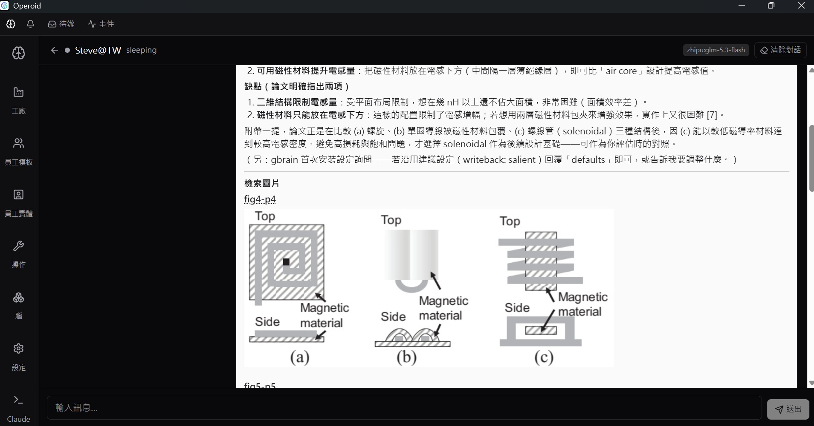

# Operoid

[English](README.md) | **繁體中文** | [简体中文](README.zh-CN.md)

> Operoid 不是一個聊天應用程式。它是一套 **AI Agent 作業系統** —— 一個作業環境，
> 讓 AI 代理（稱為 **Employee 員工**）在一個共享、持久的工作空間（**Workspace**）裡
> 持續完成有意義的工作。

多數 AI 產品以對話為中心：你問、它答，視窗一關工作就消失了。但真正的工作不是這樣。
採購助理會追蹤一張訂單長達數週；品保工程師會從異常報告、到矯正措施、再到結案一路追蹤。
這些職責需要一個能**持久、能記憶、並在視窗關閉後仍繼續運作**的環境。

Operoid 的存在，就是為了成為那個環境。

以 **Rust**（常駐服務＋Tauri v2 桌面殼）與 **Vue 3 + TypeScript** 前端打造，透過本機 HTTP API 溝通。
**作者：** 朱國棟 (Charlie Chu) · **授權：** [MIT](#授權) · **狀態：** 見[Operoid 現在能做到什麼](#operoid-現在能做到什麼)

---

## 為什麼需要 Operoid？

今日的 AI，行為更像一個**顧問**，而不是一個**員工**。顧問給完建議就離開；
員工加入組織、承擔成果、並持續負責。Operoid 是為後者而打造的。

今日的 AI 系統普遍缺乏：

- **持久的職責** —— 對話結束，工作就消失。
- **長期的承諾** —— 沒有「追蹤此事直到完成」的概念。
- **共享的工作空間** —— 沒有一個地方讓多個代理與人類就相同事物協作。
- **組織知識** —— 模型所知，並不等於組織所知。
- **企業角色** —— 代理沒有身份、職權或問責。
- **委任界線** —— 沒有一條有原則的答案，能回答「機器不必請示就能做什麼」。
- **持續的執行** —— 沒有東西會在相關事件發生時把代理喚醒。

Operoid 把 AI 視為**組織成員，而不是聊天機器人。**

## 今天就能做到的事

- **視窗關了，員工還在工作。** 常駐執行引擎依觸發喚醒員工——排程、進來的 Email、
  人類訊息——恢復上下文、讓它工作、再讓它休眠。
- **從建議到動手。** 員工在自己的沙箱工作區裡讀檔、改檔、執行指令——依**你**控制的
  模板級工具授權。沒有任何預設的放手。
- **看得見的工作過程。** 對話中，每個工具呼叫即時出現——員工讀了什麼、找到什麼、
  花了多久——回覆以 Markdown（表格、程式碼、清單）呈現。
- **一條由你畫出、機器確實遵守的界線。** 委任以動作類別為單位、從嚴預設、會屆期、
  事故自動凍結。見[人類畫得出的委任界線](#人類畫得出的委任界線)。
- **有權限的組織知識。** 同一個腦、同一個查詢、不同身份→不同結果。
  授權發生在檢索之前、fail closed。見[伺服器執行的知識界線](#伺服器執行的知識界線)。
- **文件變知識——連圖一起。** 雙欄論文、掃描報告、滿是圖表的簡報：解析成
  章節切塊筆記、每張圖一個獨立檢索項；依複雜度分流、缺了明說、
  未 opt-in 前文件不出本機。見[讀得懂整頁的文件管線](#讀得懂整頁的文件管線)。
- **從你本來就在的地方找到他們。** GUI 對話、Email、IM（WASM 外掛）——
  同樣的員工、同樣的持久職責。
- **一套程式碼，兩種版本。** 桌面安裝即用；企業部署包部署在公司自己的內網。


## 什麼是「AI Agent 作業系統」？

傳統作業系統管理行程、記憶、檔案與裝置，讓程式得以執行 —— 它提供環境，不做程式的工作。
Operoid 對 AI 代理做同樣的事：

| 作業系統概念 | 在 Operoid 裡 |
|---|---|
| **行程** | **Employee 員工** —— 被排程、執行與暫停的代理 |
| **檔案** | **Artifact 成果物** —— 由工作空間擁有、而非由對話擁有的持久產出 |
| **記憶** | **工作記憶與知識** —— 依需求恢復，而非長期駐留 |
| **裝置** | **Tool 工具** —— 透過受控介面調用的外部能力 |
| **核心（kernel）** | **Runtime 執行引擎** —— 喚醒 Employee、恢復其上下文、讓它執行、再讓它休眠 |

Runtime 管理**執行**，從不管理**思考** —— Employee 想什麼，是它自己的事。
這就是為什麼 Operoid 被稱為作業系統，而不是應用程式。

## 人類畫得出的委任界線

「該不該讓 AI 決策？」其實不是一個問題，而是三個。**能力提問**——系統能否正確決策？
**課責提問**——決策失準時，責任落在誰身上？**正當性提問**——這一類決策，是否本來就該
由人類作成？只有第一問的答案會隨技術移動；一套委任政策要成立，必須三問全過。

Operoid 把這件事當成憲法層級的原則——
**[手冊原則 11「界線由人類畫定」](handbook/Chinese/02-Design-Philosophy.md)**——並將它操作化：

- **委任的單位是動作類別**，不是「系統」——分派到三個層級：**人裁決層**、
  **圍欄自動層**、**有主自動層**。
- **從嚴預設。** 人類未登記的類別一律送人類裁決；放寬須提出證據並經簽署，收緊永遠廉價。
- **界線保持鮮活、可稽核。** 授權會屆期、須重簽；事故自動把相關類別凍結回人類裁決；
  機器的歸類由人類盲抽複核。

這些機制不是從理論發明的，而是從一個真實（已去識別化）的製造業個案蒸餾而來：
一個自主代理自行判斷「何者屬常規」，把每一次界線漂移都記為成就。
完整分析見論文**[界線的形狀](journal/界線的形狀_朱國棟.pdf)**；其機制以**動作類別登記表**的形式隨產品交付。

## 伺服器執行的知識界線

動作類別登記表畫的是**動作**的界線——Employee 可以*做*什麼；知識織網（Knowledge
Fabric，Enterprise C′）畫的是**知識**的界線——Employee 可以*知道*什麼。兩條界線有同一種憲法形狀：
由人類畫定、由伺服器確定性執行、事後可稽核。

- **授權發生在檢索之前。** 政策以確定性的程式碼評估——永不交給 LLM。
  未授權的知識不會進入 Employee 的上下文；沒有任何「先取回再遮蔽」。
- **一張織網，按範圍分區。** 全公司／部門／專案／受限知識映射到不同的 source；
  每次查詢只對**授權 source 集合**發出——由引擎本身強制，而非靠提示詞約定。
- **Fail closed。** 政策缺失或損壞＝拒絕並記錄事件；明示 DENY 規則高於一切，
  連臨時授權都無法架空。
- **身份由伺服器端裁定。** 每個 principal（人類操作者或 AI 員工）以自己的
  token 認證；身份出自 token 鏈，永不出自呼叫端的自稱。
- **特權行為皆留收據。** 誰、在哪個任務、依哪版政策、看到哪些範圍。
  臨時授權依 TTL 到期，撤銷即時失效。
- **同一腦＋同一查詢＋不同身份＝不同結果。** 這句話已對真實知識圖譜做了
  端到端實證——它是知識織網真的在運作的最小證明。


## 讀得懂整頁的文件管線

多數檢索管線讀 PDF，像影印機讀一幅畫：雙欄排版打亂、圖變成雜訊、表格糊成一片。
Operoid 把複雜文件當成**結構化知識**來處理：

- **像文件一樣解析，而不是當文字檔硬讀。** [MinerU](https://github.com/opendatalab/MinerU)
  還原閱讀順序、表格（真正的 markdown）、公式（LaTeX），以及每一張圖——
  連同圖說與頁碼。
- **像人類閱讀一樣切塊。** 筆記跟著章節邊界走；每一張圖都是**獨立的檢索項**
  （圖說＋章節＋頁碼），不再淹沒在長段落中間；表格保持原子。
- **依複雜度分流，缺什麼都明說。** 簡單 PDF 永遠不必為深度解析付費（毫秒級快速
  路徑直接處理）；缺了能力也絕不靜默失敗——沒裝 MinerU → 走快速路徑＋畫面上
  明白告知；純文字嵌入 → 圖片以圖說索引。**能力矩陣**（MinerU／多模態嵌入／
  讀圖）在每個版本都看得到——桌面設定頁，以及企業版 admin／manager／user 網頁
  ——現在能用什麼、補上什麼會解鎖什麼，一目瞭然。
- **有基準，不靠感覺。** 以一篇真實 IEEE 論文、十二道針對特定圖表的問題：
  **前五名命中 12/12、MRR 0.90**——走的是生產檢索管線，不是手調的示範。

文件是敏感的，所以這條管線遵守與其他一切相同的紀律：**預設本地，其餘分層明示。**
自己的機器永遠允許；自架端點以「設定即同意」處理；第三方雲**未明確 opt-in 前一律
擋下**——而且每次轉換都記錄資料去了哪裡。

**多模態，由你決定。** 嵌入跑在你自己的 llama-server 上。加上選配的 mmproj
投影器，圖片以「圖說＋原圖」聯合向量索引（同一個嵌入空間）——文字查詢也能
找到圖說幾乎沒寫什麼的那張圖。沒有它，圖片仍是圖說＋章節＋頁碼的一等檢索項。
應用程式會偵測並呈現你目前的模式；升級只需重嵌小小的圖片 sidecar。



## 核心概念

| 概念 | 一句話角色 |
|---|---|
| **Workspace 工作空間** | 組織。一切事物都隸屬於恰好一個。 |
| **Employee 員工** | 工作者。承擔責任的 AI 代理。 |
| **Brain 大腦** | 智能。可重用、可版本化的知識與人格。 |
| **Artifact 成果物** | 成果。工作的產出，歸工作空間所有。 |
| **Knowledge 知識庫** | 組織經策展且持久的記憶。 |
| **Tool 工具** | Employee 可調用的外部能力。它永遠不做決策。 |
| **Project 專案** | 為某個目標而成立的有限度協作。 |
| **Task 任務** | 工作單位。短期、可執行。 |
| **Commitment 長期職責** | 比任務活得更久的持久職責。 |
| **Action Registry 動作類別登記表** | 委任界線。哪些動作類別可免請示而行——由人類畫定、可稽核。 |
| **Knowledge Policy 知識政策** | 知識界線。誰可檢索哪個範圍——檢索前評估、fail closed。 |
| **Trigger 觸發器** | 決定何時該喚醒 Employee。 |
| **Runtime 執行引擎** | 管理生命週期的引擎，從不管理思考。 |
| **Event 事件** | 已發生事實的不可變紀錄。 |
| **Memory 工作記憶** | Employee 的工作上下文，每次喚醒時重新恢復。 |

完整的定義 —— 目的、職責、各自擁有什麼、生命週期與未來擴展 —— 見
**[架構手冊](handbook/Chinese/README.md)**，它是這套作業系統的憲法。

## Operoid 現在能做到什麼

架構手冊的路線圖已**一路實作至 Phase 7**——手冊中的願景是運行中的系統，
路線圖的五個里程碑全部完成（截至 **v0.4.3**）：

1. ✅ **一個真正能工作的 Employee** —— 因 Trigger 喚醒、恢復上下文、調用工具、提交成果物、休眠。
2. ✅ **持久化與 Commitment** —— 工作能挺過完全關機與重啟。
3. ✅ **共享的 Brain 與知識** —— 升級一個 Brain，多個 Employee 同步採用。
4. ✅ **範本與實例** —— 一個範本，多個獨立員工。
5. ✅ **協作** —— 一群 Employee 合作完成一個 Project。

在這個地基上，已出貨的產品包含：

- **會動手的員工，不只給建議。** 對話工具（知識檢索與推論、筆記、傳訊）之外，
  員工還有沙箱工作區：`read_file`／`write_file`／`edit_file`／`run_command`——
  依模板啟用、在自己的工作區內執行、過程即在對話中可見。todo 進度清單跨回合存活，
  長任務不漂移。
- **看得見的對話。** GUI 人機聊天：Markdown 回覆、每個工具呼叫的過程可見
  （參數、耗時、結果）、「處理中…」指示、可展開的成果物卡；經理人有自己的對話視角，
  可看任何員工的對話。Email 與 IM 經 [obridge](obridge/) 直達同樣的員工。
- **成果物是一等公民。** 持久、可版本化、歸工作空間所有（不歸對話）——
  可由 API 以 ID 取回，在對話中即可展開。
- **人類畫得出的委任界線**——**動作類別登記表**，在「設定 → 登記表」編輯
  （結構化表單；進階可切原始 JSON）。
- **伺服器執行的知識界線**——授權檢索＋「設定 → 知識授權」管理頁
  （principals 與 tokens、臨時授權、範圍→source 映射），另有使用者級知識查詢頁。
- **常駐服務架構。** `oserver` 擁有 Runtime：**無論視窗開關，Employee 持續工作**。
  可選的開機服務：Windows 已實作並實機驗證；Linux（systemd）與 macOS（launchd）
  已實作、尚未實機驗證。
- **以 [GBrain](https://github.com/garrytan/gbrain) 為基礎的知識圖譜層**——
  把日常檔案（聯絡人 CSV、會議 PDF、公司介紹）變成互連、可查詢的筆記；
  透過 GUI 而非命令列來同步、提問與推論。
- **讀得懂整頁的文件管線。** MinerU 解析（閱讀順序、表格為 markdown、公式為
  LaTeX、每張圖帶圖說與頁碼）、章節切塊、每圖一個獨立檢索項——以真實 IEEE
  論文基準**前五名命中 12/12、MRR 0.90**。簡單 PDF 走毫秒級快速路徑；
  缺了工具會在畫面上明說；egress 信任分層讓文件留在本機，除非明確 opt-in 雲端。
- **可攔截的生命週期＋恢復力。** 執行中的 Employee 可隨時**合作式停止**與**封存**
  （歷史完整保留、可追溯可解封）；出錯的承諾以指數退避**自動重試**，
  連續失敗達上限後停止並轉人工處理。細粒度過程事件 30 天自動清理；
  里程碑事件永久保留。
- 第一個**代理入口**：在工作空間內啟動並監看 [Claude Code](https://claude.com/claude-code)。

## 技術棧

**前端：** Vue 3 · TypeScript · Vite · Tailwind CSS v4 · Pinia · Vue Router · vue-i18n · lucide-vue-next
**企業前端：** `frontends/` pnpm workspace —— `@front/api-client` · `@front/ui` · `apps/{admin,manager,user}`（Vue 3.5 · Vite 6 · vue-i18n，由 `oserver` 服務）
**核心與服務：** Rust —— `ocore`（領域核心）· `oserver`（axum 服務）· `obridge`（Email/WASM 橋接）
**桌面殼：** Tauri v2（視窗＋桌面專屬能力；所有邏輯都在服務裡）

## 前置需求

要使用目前的知識圖譜功能，桌面應用需要：

| 工具 | 用途 | 安裝 |
|---|---|---|
| **git** | sync 流程會在更新圖譜前先 commit | <https://git-scm.com/downloads> |
| **bun** | `gbrain` 透過 bun 安裝與執行 | <https://bun.com/docs/installation#installation> |
| **gbrain** | GBrain 知識圖譜引擎 | <https://github.com/garrytan/gbrain> |

路徑會自動偵測（Windows 為 `~/.bun/bin/gbrain.exe`）；必要時可在「設定」頁覆寫。

選配——文件管線（複雜 PDF → 知識）：

| 工具 | 用途 | 沒有它 |
|---|---|---|
| **llama-server**（EmbeddingGemma 2） | 本機嵌入後端（檢索用）；啟動旗標見 [DEPLOYMENT.md](DEPLOYMENT.md) | 檢索退為僅關鍵字 |
| **mmproj 投影器**（選配） | 圖片的「圖說＋原圖」聯合向量 | 圖片以圖說文字索引 |
| **MinerU**（選配） | 複雜 PDF 解析（雙欄／掃描／圖表）——`uv tool install mineru` | 僅簡單 PDF（走快速路徑） |

一切能力都會被偵測並在介面上呈現：個人版在「設定 → 服務」；企業版在
admin／manager／user 三個網頁前端。

## 安裝與執行

**一般使用者 —— 直接下載預編譯安裝包即可。** 到
[**Releases** 頁面](https://github.com/ascetic168/Operoid/releases)下載對應平台的最新版本並執行。
除非你要開發 Operoid，否則不需要 `git clone` 或從原始碼建置。

### 個人版與企業版

| | 個人版 | 企業版 |
|---|---|---|
| 資產 | 桌面安裝檔 | `operoid-enterprise-*` 部署包 |
| 執行位置 | 使用者自己的電腦 | 公司內網伺服器 |
| 設定 | 無——安裝即用 | 一條引導式指令（見下） |
| 前端 | 桌面 app | 瀏覽器：`/admin` `/manager` `/user` |
| 認證 | 隱藏的本機 token | 密碼登入＋角色式權限（admin／manager／user） |
| 郵件橋接（obridge） | 內建，由桌面 app 代管 | 內建；由 oserver 代管——`/admin` 表單設定（或佈署在另一台機器） |

桌面安裝檔**就是**個人版。

企業版從同一個 Release 下載 `operoid-enterprise-*` 部署包，執行
**`oserver configure`**——引導式精靈會檢查前置需求、設定 TLS 與知識腦工作目錄、
建立管理員帳號，並可選註冊開機服務。也可以手工放一個 `operoid.toml`——
兩條路都涵蓋於 **[DEPLOYMENT.md](DEPLOYMENT.md)**（伺服器機不需 Node/pnpm）。
兩個注意事項：**不要**在企業伺服器上執行桌面 GUI（它講的是個人模式的憑證）；
兩個版本可在同一內網安全並存（個人版僅綁 loopback）。

### 安裝開機服務（Linux / macOS）

Linux 與 macOS 的開機服務在**任何使用者登入前**就會啟動
（Linux：`/etc/systemd/system` 的 systemd system unit；
macOS：`/Library/LaunchDaemons` 的 launchd LaunchDaemon）。安裝注意事項：

- 請**從你自己的帳號透過 `sudo` 安裝**（例如 `sudo oserver install`）。
  提權只用在寫入系統位置的 unit/plist 檔；服務本身以**安裝者的身分**執行，
  因此資料庫與設定檔的屬主和桌面 app 一致。
- 若安裝程式無法判定安裝使用者（例如直接在 root shell 執行），會直接
  報錯拒絕——請改從你的帳號以 `sudo` 安裝。
- 移除服務：`sudo oserver uninstall`。
- Linux／macOS 的服務路徑已實作但**尚未實機驗證**（Windows 已驗證）。

### 開發者（從原始碼建置）

建置桌面應用需要 **Rust 工具鏈**與 [Tauri v2 前置需求](https://v2.tauri.app/start/prerequisites/)。

```bash
git clone https://github.com/ascetic168/Operoid.git
cd Operoid
npm install          # 安裝依賴
npm run tauri dev    # 執行應用（熱重載）
npm run tauri build  # 建置散布用安裝包
```

僅前端（於 http://localhost:1420 在瀏覽器執行）：`npm run dev`、`npm run build`。

直接開發 `oserver`／`obridge` 時，請用 `cargo dev-build` **兩個一起編**
（或 `scripts/dev-rebuild.ps1`——會先停掉 dev 行程再建）：oserver 以 sibling
方式帶起同目錄的 `obridge`，只編單一 crate 就會跑到另一個的舊檔。兩個執行檔
都內嵌 build id（git hash）並在帶起時互相核對——不一致會在啟動 log 大聲警告，
並顯示在 admin 介面（`/api/obridge/status` 的 `exe_build_match`）。

## 開發

```bash
npm run tauri dev             # 完整應用，熱重載
npm run build                 # 前端型別檢查 + 建置
cargo test                    # Rust 單元測試（整個 workspace：ocore、oserver…）
cargo check                   # 後端快速型別檢查（整個 workspace）
```

## 專案結構

```
src/              Vue 3 前端（views、Pinia stores、i18n、HTTP 包裝）
                  —— Brains、Factories、Config、員工範本／實體、
                    員工對話、Operations（即時主控台）、收件匣
frontends/        企業網頁前端（pnpm workspace）
                  —— apps/{admin,manager,user} · packages/{api-client,ui}
ocore/            Rust 領域核心（零 Tauri 依賴）
                    domain · runtime · scheduler · event_bus · agent 狀態
                    知識授權（policy/service/planner/grants/receipts/identity）
                    GBrain 能力域（cli/brains/factories/converters）· llm
                    員工工具（工作區沙箱：read/write/edit/command）
oserver/          常駐服務 —— axum HTTP API（token 認證）
                    agent-os 讀寫面 · GBrain 全域 · 操作主控台
                    知識授權管理（principals/tokens/grants）
                    事件進氣口 /event · 服務註冊（Windows/Linux/macOS）
src-tauri/        桌面殼（Tauri v2）—— 視窗＋桌面專屬功能
                    （Claude Code、筆記預覽）、指令薄層、服務代管
obridge/          Email 橋接器＋WASM 外掛宿主（IMAP 收／SMTP 寄）
ocontract/        共享契約型別（Operoid ↔ obridge）
handbook/         架構手冊 —— 憲法（英文 + 中文）
```

## 路線圖

路線圖勾勒於手冊中，依依賴關係排序。五個里程碑皆已**實作至 Phase 7**
（已出貨狀態見[Operoid 現在能做到什麼](#operoid-現在能做到什麼)）。

Phase 7 新增了**人機協作層**：交辦承諾給人類、Message 概念、聊天對話與錯誤韌性。
完整說明見[第二十一章 — 路線圖](handbook/Chinese/21-Roadmap.md)。

## 參與與回饋

- **試用**：到 [Releases 頁面](https://github.com/ascetic168/Operoid/releases)取得最新版本。
- **深讀**：[架構手冊](handbook/Chinese/README.md)是這套系統的憲法——概念、原則與背後的推理。
- **問題與回饋**：開一個 [GitHub issue](https://github.com/ascetic168/Operoid/issues)。

## 授權

本專案以 **[MIT 授權](LICENSE)** 釋出。
Copyright © 2026 朱國棟 (Charlie Chu)。完整條文見 [LICENSE](LICENSE)。
